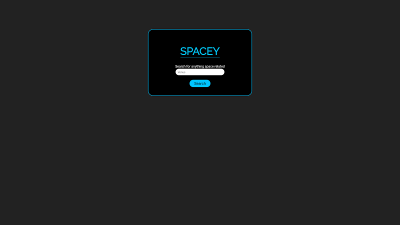
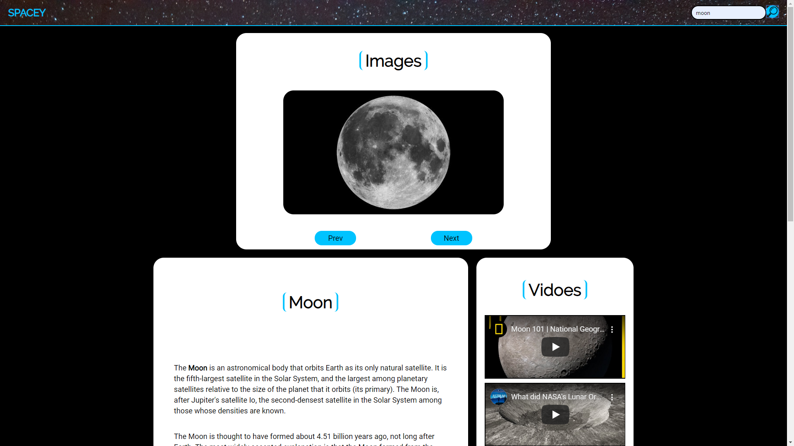

# Spacey

An application that helps users learn more about outer space. Users can search for space-related topics and find pictures, videos, and info related to their search.

## Motivation 

I have always been fascinated by space and the possibilities it presents us. I also love to get sucked into a Wikipedia rabbit hole. So I wanted to create something that would help users easily find and get absorbed in educational material about space.

## How to Use 

Spacey is extremely easy to use. Just enter a term into the search bar and click search. Users who rely on accessibility features can easily search using their keyboard. Click the previous and next buttons to cycle through images. I provide links to Wikipedia at the bottom of the reading section, and you can access links to youtube by clicking the title of a video.

## Technology Used

HTML/CSS/JavaScript/jQuery

## Checkout the Live Demo!

- [Live Demo Here](https://f3ve.github.io/Spacey/)

## Screenshots

Landing Page:

Main Page:

